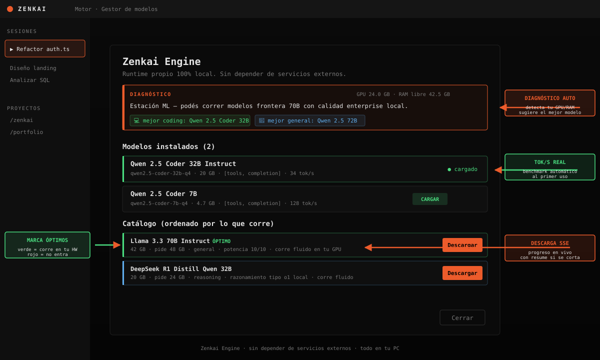
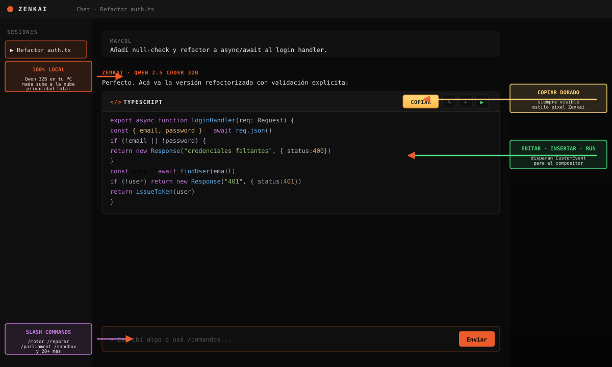

<h1 align="center">ZENKAI</h1>

<p align="center"><b>Asistente de código local + nube · 100% gratis · sin subscription</b></p>

<p align="center">
  <a href="https://github.com/zunocapital-png/zenkai-releases/releases/latest">
    
  </a>
  
  
</p>

<p align="center">
  
</p>

---

## 📥 Descarga

**No necesitás compilar nada. Descargá el instalador de tu plataforma:**

### 👉 [https://github.com/zunocapital-png/zenkai-releases/releases/latest](https://github.com/zunocapital-png/zenkai-releases/releases/latest)

| Plataforma | Archivo | Peso |
|---|---|---|
| **Windows** | `zenkai-desktop-win-x64.exe` | ~130 MB |
| **macOS ARM** | `zenkai-desktop-mac-arm64.dmg` | ~140 MB |
| **Linux .deb** | `zenkai-desktop-linux-amd64.deb` | ~126 MB |
| **Linux AppImage** | `zenkai-desktop-linux-x86_64.AppImage` | ~164 MB |

Al abrir la app la primera vez, un **wizard de 30 segundos** te guía: detecta tu equipo, sugiere el mejor modelo, y tenés IA lista para chatear sin configurar nada más.

---

## 🎯 Qué hace Zenkai

Zenkai es un asistente de código que **vive en tu computadora**, con motor local propio + posibilidad de conectar cualquier proveedor cloud si lo elegís.

- **Chat con IA** sobre tu código, offline o con cloud gratis.
- **Diagnóstico automático de HW** — te dice qué modelo aguanta tu equipo antes de descargar 20 GB al pedo.
- **Motor propio** compatible con GGUF (Qwen 32B, Llama 70B, DeepSeek R1) sin depender de servicios externos.
- **Multi-provider con failover** — si un proveedor cae, salta al siguiente sin cortar el stream.
- **Sub-agentes cognitivos**: reflector, auto-repair, parliament, sandbox.
- **40+ MCPs curados** (Git, filesystem, web, browser, Postgres, Slack, etc.).
- **Cost tracking USD real** por proveedor y por request.
- **Auto-update** con electron-updater.

---

<p align="center">
  
</p>

## 💬 Chat con bloques de código estilo pro

- Header con **lenguaje visible** + **botón Copiar dorado siempre presente**.
- Iconos de acción: **✎ editar**, **[+] insertar**, **▶ ejecutar**.
- Syntax highlight nativo con Shiki para 50+ lenguajes.
- Streaming en vivo con backpressure real.

---

## ⚡ Slash commands

Escribí `/` en el chat para ver todos con autocompletado. Los principales:

| Comando | Qué hace |
|---|---|
| `/motor` | Gestor de modelos GGUF + diagnóstico HW + tok/s en vivo |
| `/comandos` | Catálogo completo de todos los slashes |
| `/reflexionar` | Otro modelo re-lee la respuesta anterior y la puntúa |
| `/reparar` | Test → si falla, LLM propone fix → aplica → retesta |
| `/parliament` | N modelos votan una decisión con confianza |
| `/sandbox` | Corre código Node/Python/Bash aislado con timeout |
| `/costos` | Gasto USD por proveedor + budget |
| `/observability` | Motor en vivo (latencias, health, breaker) |
| `/setup` | Wizard configuración en 3 pasos |
| `/estado` | Estado global de todo el sistema |
| `/imagen` | Generador de imágenes desde el chat |
| `/computer` | Ver la pantalla mientras la IA la controla |

---

## 🧠 Modelos soportados

**Locales** (offline, privacidad total):

| Rango | Modelos | VRAM/RAM |
|---|---|---|
| Tiny | Qwen 2.5 1.5B, Qwen 2.5 3B | 2-4 GB |
| Small | Qwen 2.5 Coder 7B, Llama 3.1 8B, Phi-4 14B | 6-12 GB |
| Medium | Qwen 2.5 14B, Codestral 22B | 12-16 GB |
| Large | **Qwen 2.5 Coder 32B**, Qwen 2.5 32B, **DeepSeek R1 Distill 32B**, QwQ 32B | 24 GB |
| Frontier | Llama 3.3 70B, Qwen 2.5 72B | 48+ GB |
| Vision | Qwen 2.5 VL 7B | 8 GB |

Todos vienen del catálogo curado en `/motor`. Descarga directa desde HuggingFace con progress SSE y resume si se corta.

**Cloud** (opcional, con tu API key):
OpenAI · Anthropic · Google · Groq · Cerebras · DeepSeek · OpenRouter · Together · Fireworks · Perplexity · Mistral · xAI · NVIDIA NIM · Azure · Bedrock · Vertex · Cohere · 30+ providers preconfigurados.

---

## 🔒 Privacidad

- **Todo local por default**. Cloud solo si vos activás tu propia API key.
- **Cero telemetría**, cero envío de tu código a terceros sin autorización explícita.
- **Modo "solo local"** desde `/politicas` para forzar que nada salga del equipo.
- **Bundle sync encriptado** AES-256-GCM para llevar sesiones entre dispositivos vía cualquier medio (USB, Dropbox, iCloud) — no montamos backend propio.

---

## 🖥️ CLI terminal

Además de la app desktop, hay un CLI para automatizar desde terminal:

```bash
zenkai pull qwen2.5-coder-32b-q4    # descargar modelo
zenkai list                          # listar instalados + tok/s
zenkai chat "explicá TypeScript generics"
zenkai diagnostico                   # recomendaciones según tu HW
zenkai health                        # estado del router
zenkai smoke                         # 12 checks auto (dogfooding)
```

Requiere la app desktop corriendo (o `zenkai serve` — WIP standalone).

---

## 🛠️ Features únicos vs competencia

Lo que Zenkai tiene y otras apps no:

- **Diagnóstico HW automático** con recomendación de modelo antes de descargar
- **Semantic cache** (dedup de requests por similitud coseno con embeddings)
- **Failover multi-provider** con circuit breaker de 3 estados
- **AI Parliament** — N modelos votan decisiones críticas
- **Auto-repair loop** — test → fix propuesto por LLM → retest
- **Reflector** — sub-agente que re-lee y puntúa respuestas
- **Cognitive Sandbox** — child_process aislado con env whitelist + timeout
- **Docker Sandbox** opcional con hardening + fallback graceful
- **Mobile pairing** por QR con token 64-hex + TTL
- **Voz duplex** con VAD para interrumpir TTS
- **LoRA training** con unsloth + progress SSE
- **Codebase indexer** local en SQLite vector store
- **Screenshot → código** para React/HTML/Solid/Vue con preview iframe
- **App scaffold generator** (Vite React, Bun Elysia, static HTML, más)
- **ZenkaiFile** — superset del Modelfile con MEMORY / CAPABILITY / TOOLS

Total: **310+ tests reales pasando**, typecheck limpio, 30+ endpoints /v2/*.

---

## 👤 Autor

**Zuno Company** — Maycol Velazquez · Argentina

Licencia MIT. Zero subscripciones, zero telemetría, zero drama.
